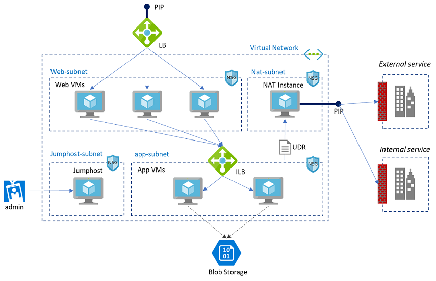

# README

> Script works with Terraform `v0.12.10`. You may need to upgrade the scripts if you want to use `v0.12.12`

> Scripts are revised for [Terraform AzureRM v1.30.0](https://github.com/terraform-providers/terraform-provider-azurerm/milestone/45).

## Sample architecture



N-Tier architecture service with a jumphost and a NAT instance.
NAT instance is used for SNATing outbound from VMs in app-subnet.  

Other samples:
- [AKS Sample](./README-aks.md)
- [PaaS (App Service + SQL DB) samples](https://github.com/iljoong/azure-tf-paas)
- [IoT samples](https://github.com/iljoong/azure-tf-iot)
- [Jmeter environment sample](https://github.com/iljoong/azure-jmeter)
- [DevOps environment sample](https://github.com/iljoong/azure-devops/tree/master/terraform)

## How to run

### Preparation

Download and install terraform: https://www.terraform.io/downloads.html

Update variables such as `subscription_id` and `admin_name` in [variables.tf](./variables.tf)

### Azure Service principal

Run following command to get a service principal info.
Note that if you have multiple subscriptions then you should set right default subscription.

```
az account set -s <subscription_id>
az ad sp create-for-rbac --role="Contributor" --scopes="/subscriptions/<subscription_id>"
```

> You don't need to create SP if you're using Azure CLI environment, such as _Azure Shell_. See [Authenticating using the Azure CLI](https://www.terraform.io/docs/providers/azurerm/auth/azure_cli.html) for more information

> You can also enable MSI to run terraform witout SP on your Azure VM. See [Authenticating using managed identities for Azure resources](https://www.terraform.io/docs/providers/azurerm/guides/managed_service_identity.html) and please refer (MSI documentation)[https://docs.microsoft.com/en-us/azure/active-directory/managed-identities-azure-resources/tutorial-linux-vm-access-arm] for how to setup MSI.

### Run terraform

Initialize first,

```
terraform init
```

Then apply terraform

```
terraform apply
```

## Feature highlight

1. VM login - ssh public key or password
2. Disk - OS disk with >30GiB and datadisk
3. OS image - default or custom image
  for building custom image, refer [packer](./packer)
4. Create multiple VMs
5. Setting LB
6. NAT instance - provision NAT instance, configure UDR and configure NAT using VM extension
7. ASG - create and apply ASG
8. Blob - create blob account and upload a file

For more information, please refer [DOC.md](./DOC.md)

## SNAT test

After provisioned, login to one of `app` vm through jump box and test source ip using following command

```
curl ipinfo.io
```

## Reference

### Azure

- provider: https://www.terraform.io/docs/providers/azurerm/

- example: https://github.com/terraform-providers/terraform-provider-azurerm/tree/master/examples

### Terraform

- terraform syntax: https://www.terraform.io/docs/configuration/syntax.html

- iterpolation: https://www.terraform.io/docs/configuration/interpolation.html

### Tips

- lb-pool associate vms: https://github.com/hashicorp/terraform/issues/13663

- loops: https://blog.gruntwork.io/terraform-tips-tricks-loops-if-statements-and-gotchas-f739bbae55f9
